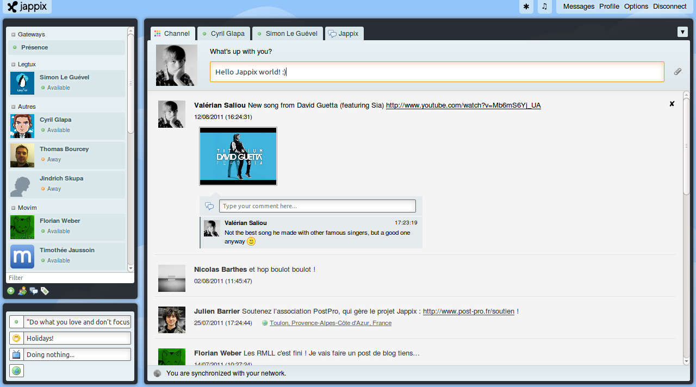

<!--
Nota bene : ce README est automatiquement généré par <https://github.com/YunoHost/apps/tree/master/tools/readme_generator>
Il NE doit PAS être modifié à la main.
-->

# Jappix pour YunoHost

[](https://dash.yunohost.org/appci/app/jappix)  

[](https://install-app.yunohost.org/?app=jappix)

*[Lire le README dans d'autres langues.](./ALL_README.md)*

> *Ce package vous permet d’installer Jappix rapidement et simplement sur un serveur YunoHost.*  
> *Si vous n’avez pas YunoHost, consultez [ce guide](https://yunohost.org/install) pour savoir comment l’installer et en profiter.*

## Vue d’ensemble

Jappix, a full-featured XMPP web-client (Jappix Desktop, Jappix Mobile & Jappix Mini). 


**Version incluse :** 1.2~ynh3

## Captures d’écran



## :red_circle: Anti-fonctionnalités

- **Paquet non maintenu**: Ce package YunoHost n'est plus maintenu et doit être adopté.

## Documentations et ressources

- Site officiel de l’app : <https://jappix.org/>
- Dépôt de code officiel de l’app : <https://github.com/jappix/jappix/>
- YunoHost Store : <https://apps.yunohost.org/app/jappix>
- Signaler un bug : <https://github.com/YunoHost-Apps/jappix_ynh/issues>

## Informations pour les développeurs

Merci de faire vos pull request sur la [branche `testing`](https://github.com/YunoHost-Apps/jappix_ynh/tree/testing).

Pour essayer la branche `testing`, procédez comme suit :

```bash
sudo yunohost app install https://github.com/YunoHost-Apps/jappix_ynh/tree/testing --debug
ou
sudo yunohost app upgrade jappix -u https://github.com/YunoHost-Apps/jappix_ynh/tree/testing --debug
```

**Plus d’infos sur le packaging d’applications :** <https://yunohost.org/packaging_apps>
